# Gyanbuddy — Bug-fix report (customer bug list)

This document captures the fixes made against the customer's "Open Bugs" list,
with **before → after** screenshots for every change. It is intended for an
internal review pass **before** the branch is committed/pushed.

- **Branch:** `worktree-gyanbuddy-bugfixes`
- **Stack verified:** local Django backend (SQLite) on `:8001`, two frontends —
  original on `:5173`, fixed on `:5174` — both pointing at the same backend so
  the screenshots are a true A/B of the *same data*.
- **Login used for screenshots:** `alice.sharma` / `Test@1234`.
- **Build status:** `tsc -b` clean, `npm run build` passes.

> **How the screenshots were produced.** A demo module *“Acids, Bases & Salts”*
> was seeded under **Science** with later chapters that are **assigned a due
> date but not yet started** — the exact condition that exposes the journey
> bugs. Chapters 1–2 are completed, chapter 3 (*The pH Scale*) is the current
> one, chapters 4–5 are **due**, chapter 6 has no due date. Everything else uses
> the standard seed data.

---

## Summary

| # | Bug (customer wording) | Status |
|---|------------------------|--------|
| 1 | All topics are due but show as **locked** | ✅ Fixed |
| 2 | Character is not moving | ✅ Fixed |
| 3 / 6 / 11 | Completed topics still clickable / can redo; can't start current | ✅ Fixed |
| — | Topic-number inconsistency (char 3 / panel "Topic 4" / bar 2/8) — also #12 | ✅ Fixed |
| 5 | Should say **Due** before the day passes, **Overdue** after | ✅ Fixed |
| 7 | Completed chapter → green line + tick | ✅ Fixed |
| 8 | Due / overdue line in subject screen | ✅ Already correct (verified) |
| 16 | Learn page: remove "quiz", remove "X items of content", image only when present | ✅ Fixed |
| 4.1 | Home **Start** should open the Subjects screen, not the Journey page | ✅ Fixed |
| Tests | Past exam ("July 22") still shows **Start**; Skipped tab shows non-skipped | ✅ Fixed |
| 12 / 13 | Count + progress wrong until clicked (Physics "20"→5, Geo "0%"→9%) | ✅ Fixed |
| 14 / 15 | Wrapped chapter chips not centred (5 per row) | ✅ Fixed |
| 16 (home) | Home card should list **chapters (modules)** with tick + due names, not topics | ✅ Fixed |
| 17 | Quiz progress bar should fill once an answer is selected | ✅ Fixed |
| 17 | Quiz hint popover alignment | ◑ Improved (compact, anchored under the lamp) |
| 19 | Show the option the student selected on the last attempt | ✅ Fixed |
| 9 | Civics chapters not showing (vs previous webapp) | ⚠️ Backend/data — modules endpoint returns empty |
| 20 / leaderboard | Leaderboard class dropdown (multiple classes) | ⚠️ Needs backend (class filter + class list) |
| 14 (lines) / home gap / rail | Podium connector alignment; home bottom gap; rail scroll | ◑ Minor / partly addressed |
| "Query params instead of path params (all pages)" | URL scheme | ⏳ Planned — app-wide routing change (see end) |

Files touched: `src/types/module.ts`, `src/features/module/{ModuleChapterPage,JourneyPath,ChapterTheoryPage}.tsx`, `src/features/subject/SubjectListPage.tsx`, `src/features/test/TestListPage.tsx`, `src/features/home/HomePage.tsx`, `src/features/quiz/FlutterQuizScreen.tsx`.

---

## The root cause behind most journey bugs

The backend sends, for each chapter, a **progress status** (`not_started` /
`in_progress` / `completed`) **plus a separate `is_due` flag and `due_date`**.
It **never** sends `status: "due"`.

The frontend's chapter model **dropped `is_due` and `due_date`** and only ever
checked `status === 'due'` — which is never true. So a chapter that is *assigned
and due* but not yet started fell through to the "locked" branch: grey podium,
not clickable, no due label. This one gap caused bugs **#1, #5, #8, #13** and
contributed to **#2, #11, #12**.

**Fix:** `parseChapter` now reads `due_date` / `is_due`, derives `isDue`
(assigned & not completed) and `isOverdue` (deadline passed), and every consumer
uses them. (`src/types/module.ts`)

---

## 1 · Due topics shown as locked  ·  #1, #5, #11

**Earlier:** chapters with a due date (but not started) rendered as **grey,
locked** podiums and could not be tapped. The current podium had the character
but the deadline was never shown.

**Now:** due chapters render as **blue, tappable** podiums; the current topic is
always startable; the side card shows **“Overdue 19 Jun”** (or “Due …” before
the deadline). Only chapters with *no* due date stay locked (chapter 6 here).

| Before (`:5173`) | After (`:5174`) |
|---|---|
| 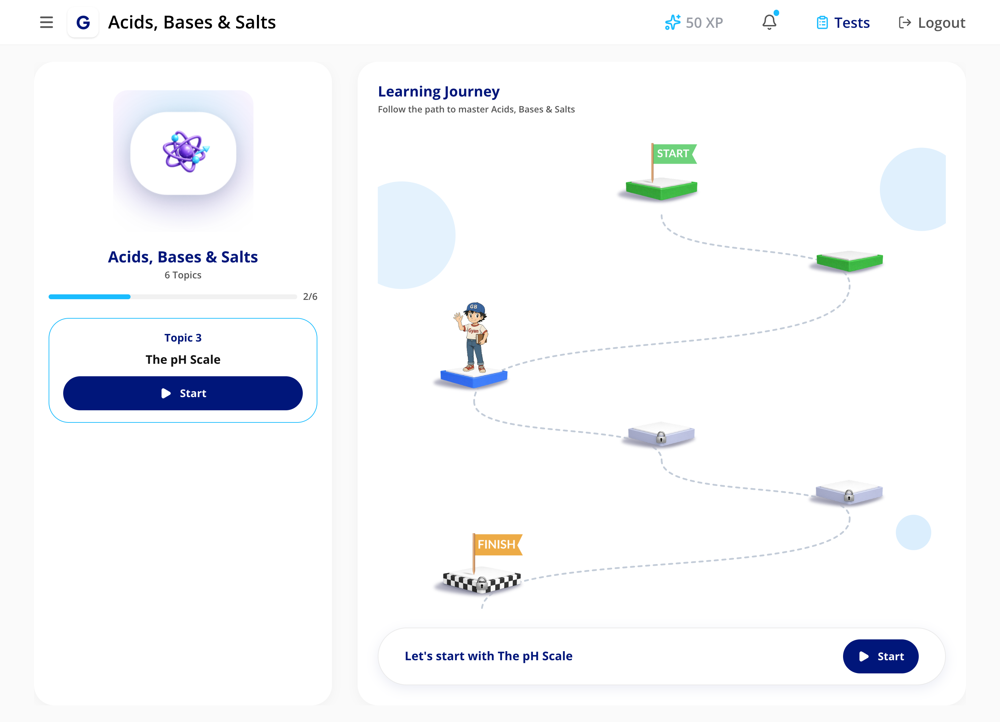 | 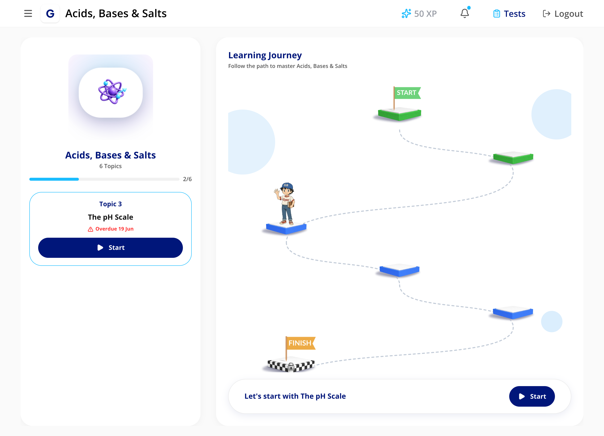 |

Notice chapters 4 & 5 (the two lower podiums): **grey padlocks → blue platforms**,
and the **“⚠ Overdue 19 Jun”** label now appears under *Topic 3*.

*Files:* `src/types/module.ts` (parse `due_date`/`is_due`, add `isOverdue`),
`src/features/module/JourneyPath.tsx` (due → blue art; current/in-progress/due
are tappable, completed never is), `src/features/module/ModuleChapterPage.tsx`
(the `Due`/`Overdue` label).

---

## 2 · Character position / topic number / progress were inconsistent  ·  #2, #12

**Earlier:** the character podium, the “Topic N” label and the progress bar were
each computed from a *different* rule, so they disagreed (the customer saw the
character on the 3rd podium, the side panel saying “Topic 4”, and the bar saying
“2/8”).

**Now:** all three derive from a **single** value — *the first non-completed
chapter*. The character stands on it, the label is its position, and the bar is
`completed / total`. They can no longer drift apart. The character also advances
correctly as topics are completed (the quiz-completion flow already invalidates
the cached progress).

*Files:* `src/features/module/ModuleChapterPage.tsx` (`currentChapter = first
not-completed`), `src/features/module/JourneyPath.tsx`.

---

## 3 · Completed chapters were re-openable; current one wasn't startable  ·  #3, #6, #11

**Earlier:** on the journey **and** the Subjects screen, **completed** chapters
were still clickable (you could redo them), while a due-but-not-started chapter
could be un-clickable.

**Now:** completed chapters are **not** clickable anywhere; the current / due /
in-progress chapters **are**. See the Subjects screen below (#7) and the journey
above (#1).

*Files:* `src/features/module/JourneyPath.tsx`, `src/features/subject/SubjectListPage.tsx`.

---

## 7 · Completed chapter → green tick + green bar  ·  #7

**Earlier:** a completed ("Done") chapter chip on the Subjects screen looked the
same as any other — cyan progress bar, no completion mark, still tappable.

**Now:** completed chips show a **green tick badge** and a **green** progress bar,
and are no longer tappable (#6).

| Before (`:5173`) | After (`:5174`) |
|---|---|
| 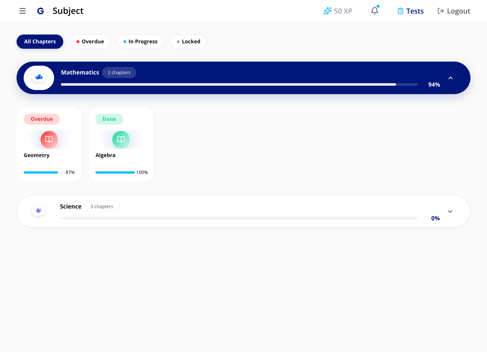 | 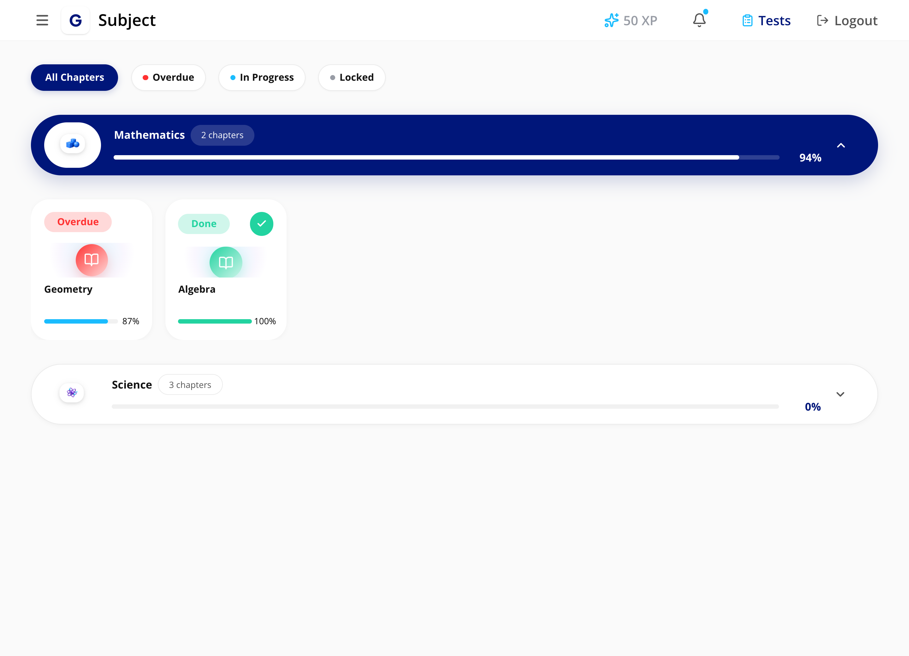 |

See the *Algebra* (Done) chip: a green ✓ badge appears and the bar turns green.
*Geometry* keeps its **Overdue** chip (the due/overdue line of #8 was already
correct — verified).

*File:* `src/features/subject/SubjectListPage.tsx`.

---

## 16 · "Learn mode" page cleanup  ·  #16

**Earlier:** the topic page showed a **"📖 N items of content"** line, and the
action bar said **"Start the quiz for …"** / **"Start Quiz"**.

**Now:** the "items of content" line is **removed**, and the wording drops
**"quiz"** → **"Start <topic>"** / **"Start"**. The image box already shows
**only when the chapter actually has an image** (none here, so no image — the
"happy case" with an image is unchanged), and the theory sits in the
**"What you'll learn"** box.

| Before (`:5173`) | After (`:5174`) |
|---|---|
| 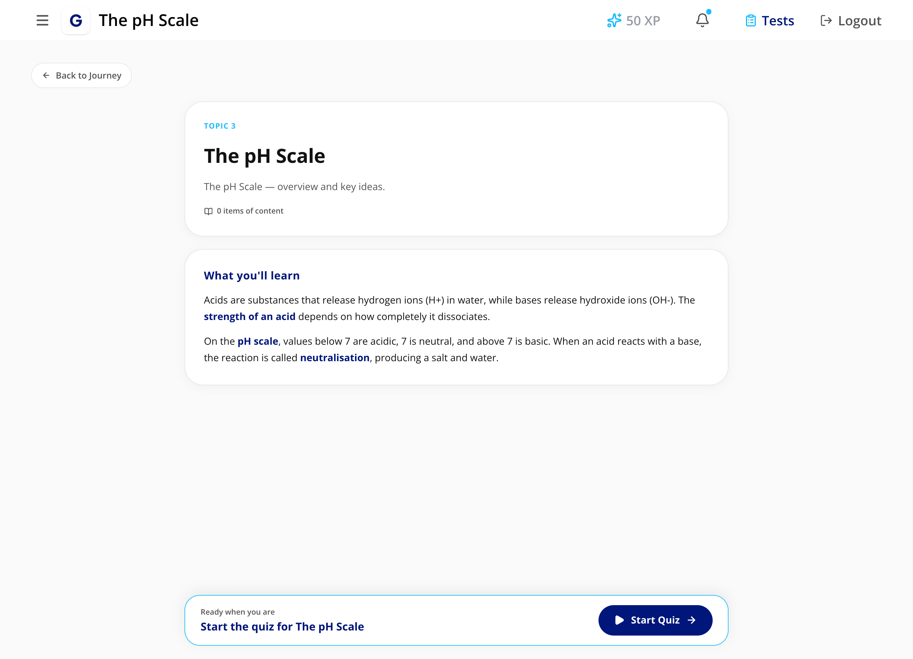 | 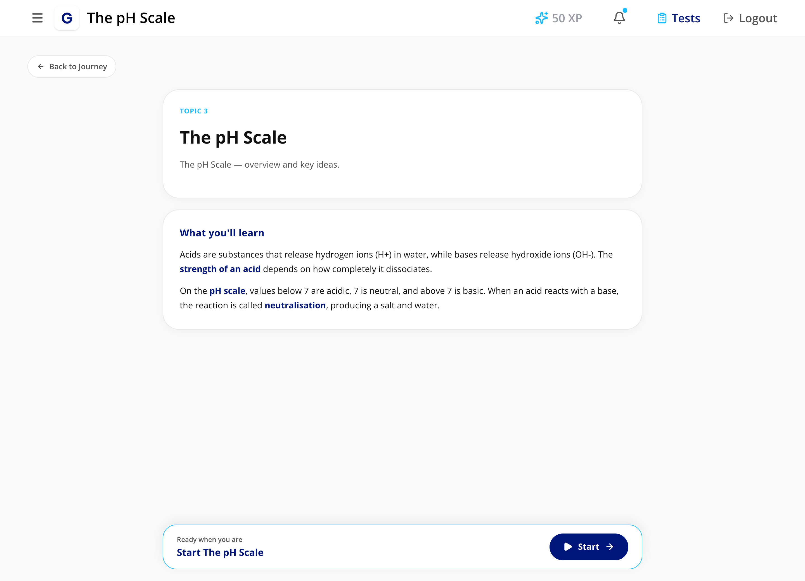 |

*File:* `src/features/module/ChapterTheoryPage.tsx`.

---

## Tests · Past exam still showed Start; Skipped tab mixed in other states

**Earlier:** the list used a date-only status that put **in-progress** tests into
the **Skipped** bucket, and showed a **Start** button on **every** non-completed
test — including ones whose window had already passed ("July 22 exam is over
still shows the start button").

**Now:** status is **window-aware** (`upcoming` → `active` → `skipped` →
`completed`); **skipped/completed tests have no Start button** (read-only);
in-progress/active tests stay actionable and are no longer counted as skipped.

| Before (`:5173`) | After (`:5174`) |
|---|---|
| 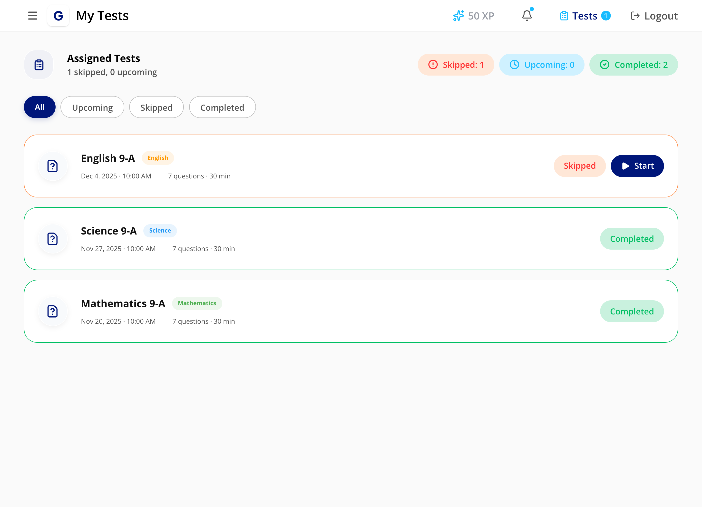 | 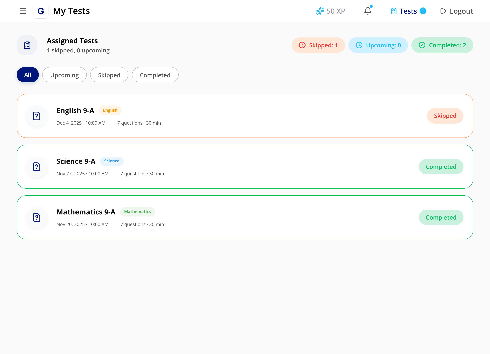 |

The past *English 9-A* test keeps its **Skipped** chip but the **Start** button
is gone.

*File:* `src/features/test/TestListPage.tsx`.

---

## 4.1 · Home "Start" went to the Journey page

**Earlier:** the **Start** button on the Home active-subject card jumped straight
into the **Journey** page.

**Now:** it opens the **Subjects** screen with that subject expanded — matching
the requested flow. (This is a navigation change, so it isn't a single-pixel
diff: *before* it landed on the journey screenshot above, *after* it lands on the
subjects screenshot above.)


*File:* `src/features/home/HomePage.tsx`.

---

# Round 2 — fixes from your annotated screenshots

## 12 / 13 · Wrong count + progress until you click  ·  #12, #13

**Earlier:** a *collapsed* subject row showed the backend's stale module count
and **0%** progress, because modules were only fetched when the row was expanded.
That's why Physics read "20 chapters" and Geography "0%" — and they "corrected"
only after a click.

**Now:** every subject row fetches its modules up front, so the collapsed count
and progress match the expanded view immediately. (Mathematics below goes from
**0% → 75%**.)

| Before (`:5173`) | After (`:5174`) |
|---|---|
| 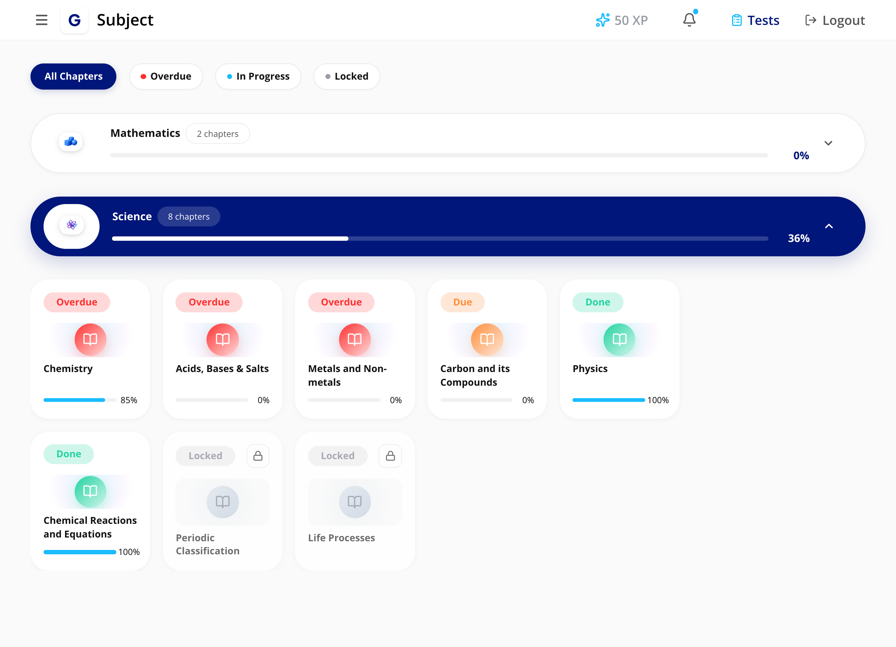 | 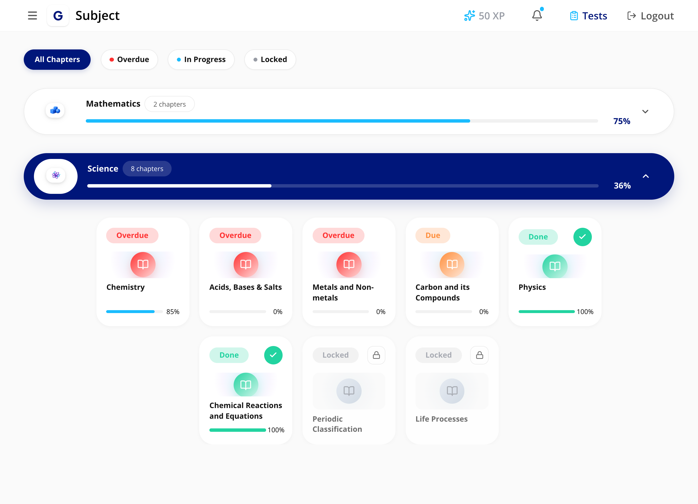 |

## 14 / 15 · Centre the wrapped chapter chips  ·  #14, #15

**Earlier:** with more than 5 chapters the second row was **left-aligned** (see
*Chemical Reactions / Periodic / Life Processes* hugging the left above).

**Now:** the chip block is a centred flex layout — 5 per row, the final row
centred. (Same screenshots above — note the second row is now centred, and the
completed "Done" chips carry the green tick + green bar from #7.)

## 16 (home) · List chapters (modules), not topics

**Earlier:** the Home card listed the active module's **topics** ("Atoms and
Molecules", "Structure of Atom") and counted "2 chapters".

**Now:** it lists the subject's **chapters (modules)** — completed ones with a
green tick, due/overdue ones with a label — and counts all of them ("8 chapters").

| Before (`:5173`) | After (`:5174`) |
|---|---|
| 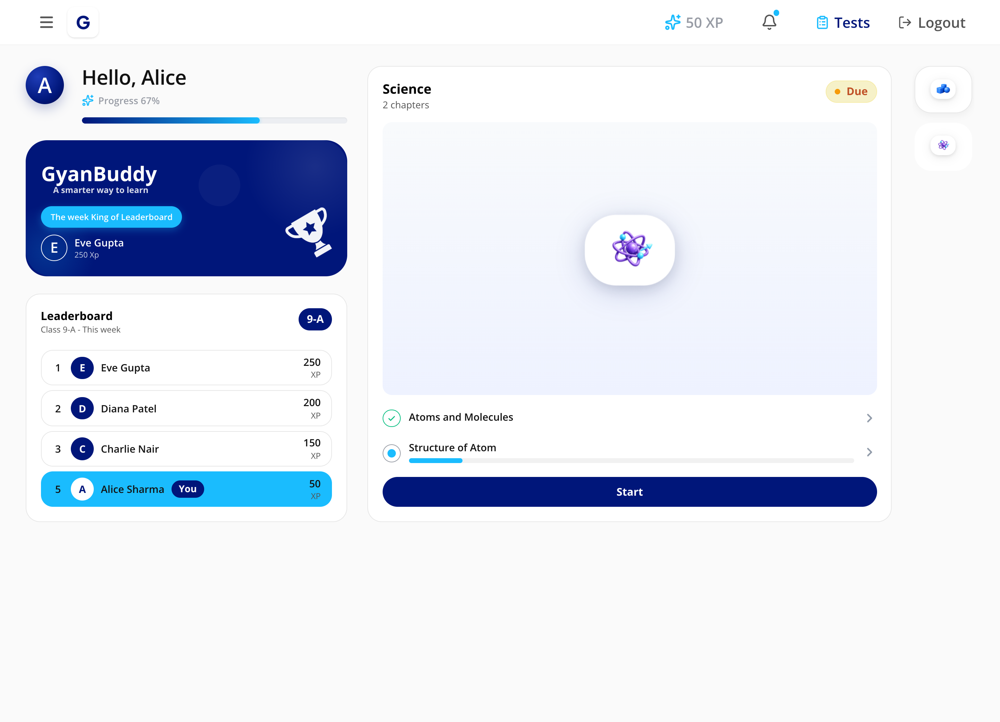 | 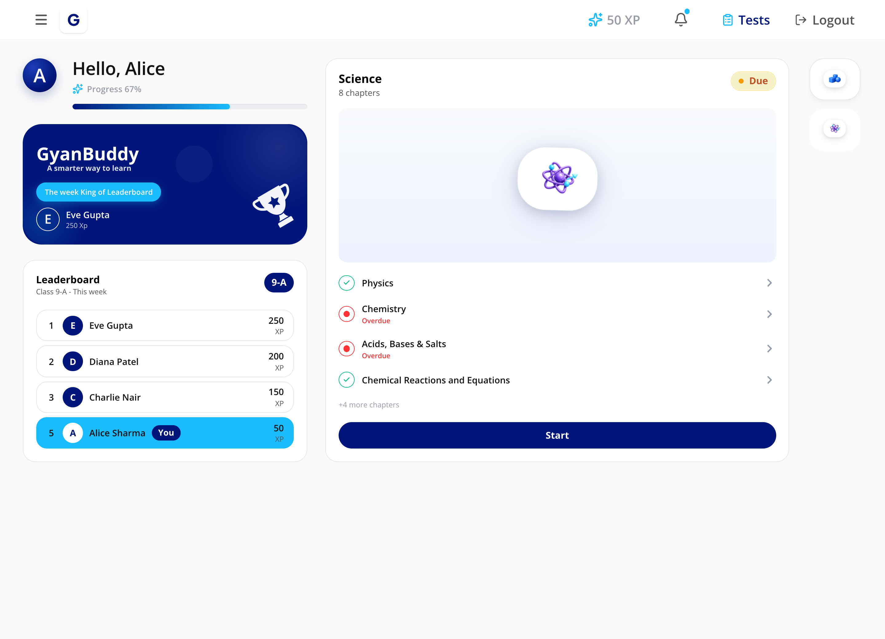 |

## 17 · Quiz progress bar fills on selection  ·  #17

**Earlier:** the bar stayed **empty** on the current question (it only advanced
after pressing Continue).

**Now:** it includes the current question the moment an answer is selected.

| Before (option picked, bar empty) | After (option picked, bar fills) |
|---|---|
| 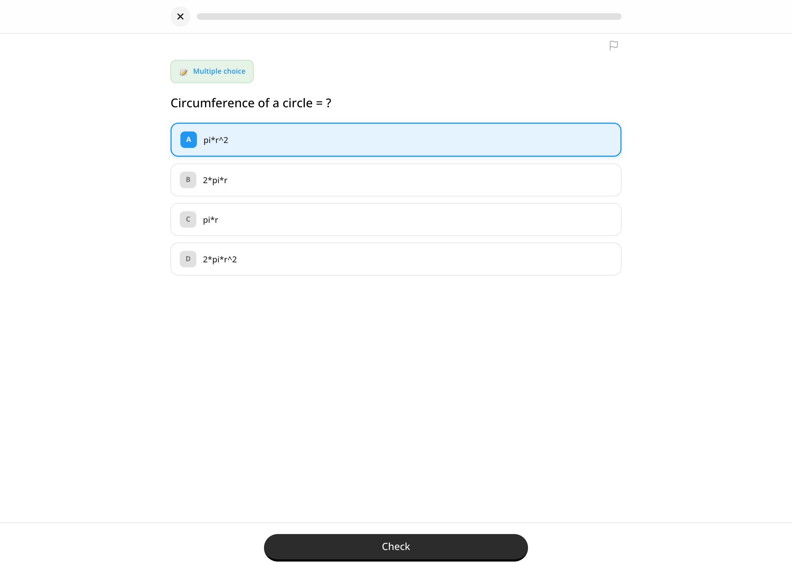 | 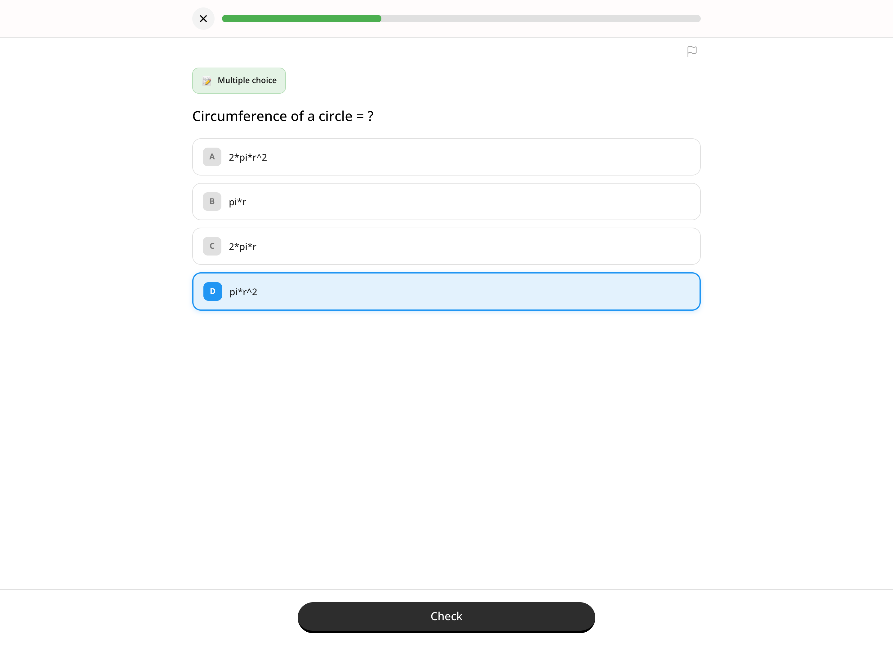 |

The **hint popover** is also now a compact callout anchored under the lamp
(best-effort match to the previous webapp — tell me if you want it tweaked further).

## 19 · Show the student's chosen option on the last attempt  ·  #19

**Earlier:** after two wrong attempts the question locked and **every** non-correct
option — including the one the student actually picked — greyed out with a 🚫, so
you couldn't tell what they chose.

**Now:** their pick stays highlighted in the blue "your answer" style next to the
green correct answer.

| Before (chosen `pi*r` greyed 🚫) | After (chosen `pi*r` blue) |
|---|---|
| 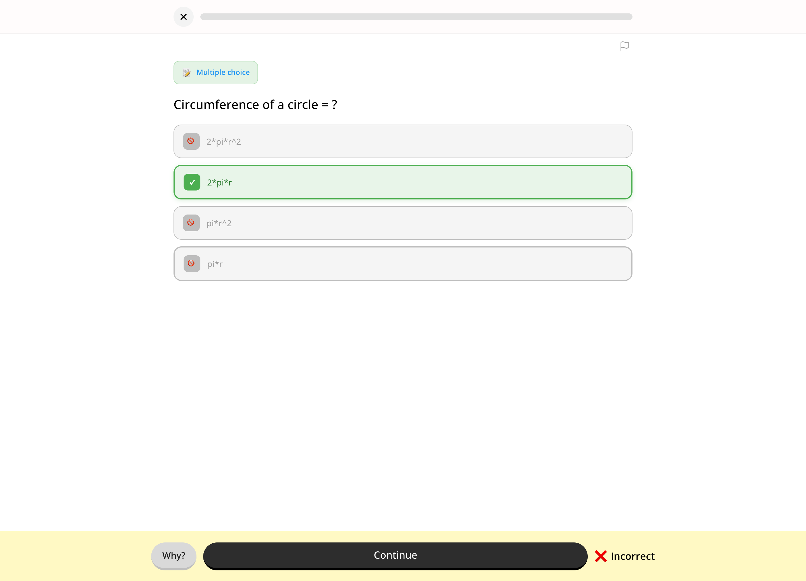 | 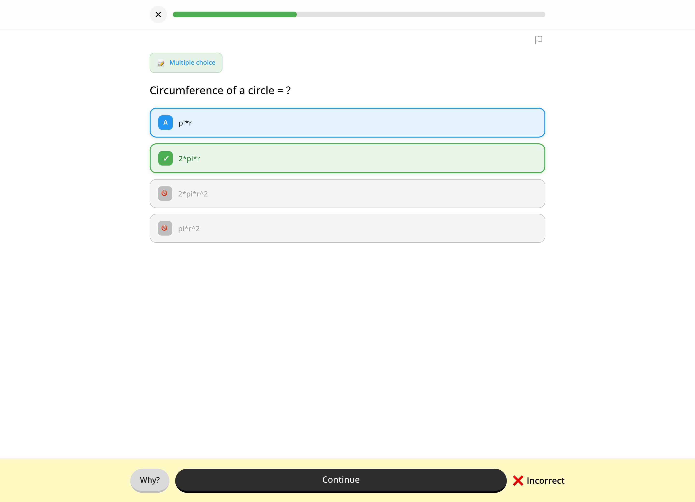 |

> All quiz routes (chapter / mission / test) render **`FlutterQuizScreen`** — the
> older `QuizFlow` is never mounted — so the quiz fixes (#17, #19) live there.

*Files:* `src/features/subject/SubjectListPage.tsx` (count/progress + centring),
`src/features/home/HomePage.tsx` (module list), `src/features/quiz/FlutterQuizScreen.tsx` (#17, #19).

---

## Still open — and why

**Planned (app-wide change):**
- **Query params instead of path params (all pages)** — I'll convert routes like
  `/subjects/:subjectId/modules/:moduleId/chapters/:chapterId` to query-string URLs
  (e.g. `/journey?subject=…&module=…&chapter=…`), updating every route, every
  `useParams`, and every `navigate` call. It's a cross-app routing change, so I
  kept it out of this batch to let the verified fixes land cleanly. Confirm the
  scheme (or just "get the IDs out of the path") and I'll do it in one focused pass.

**Needs backend / product decision:**
- **Leaderboard class dropdown (#20)** — your reference shows a class picker
  (10-A, 10-B, …). The leaderboard API ranks one cohort; a class selector needs a
  backend `class` filter + a class list. The frontend dropdown is quick once the
  API supports it.
- **#9 Civics chapters missing** — on this data the modules endpoint returns
  **empty** for Civics, so there's nothing to render. The previous webapp showed 5.
  That's a backend/`is_enabled` data issue — point me at the tenant/account and I'll
  confirm. (The count is now consistent — it no longer claims "5 chapters" over an
  empty list.)

**Minor visual (need the exact reference to pixel-match):**
- #14 podium **connector-line** alignment on the journey; the home card **bottom
  gap** + subject-rail scroll affordance (#2/#3) — partly improved (the card is
  fuller now), but exact spacing/scroll behaviour needs the Figma/previous-webapp
  measurements.

---

## How to run the A/B locally

```bash
# backend (from backend/)
DJANGO_SETTINGS_MODULE=gyaan_buddy.settings.local_sqlite ./venv/bin/python manage.py runserver 0.0.0.0:8001

# fixed frontend (from this worktree)
npm run dev   # → http://localhost:5174  (.env.local points VITE_BASE_URL_DEV at :8001)
```

Login `alice.sharma` / `Test@1234`. The demo module is **Science → “Acids, Bases
& Salts”**.
